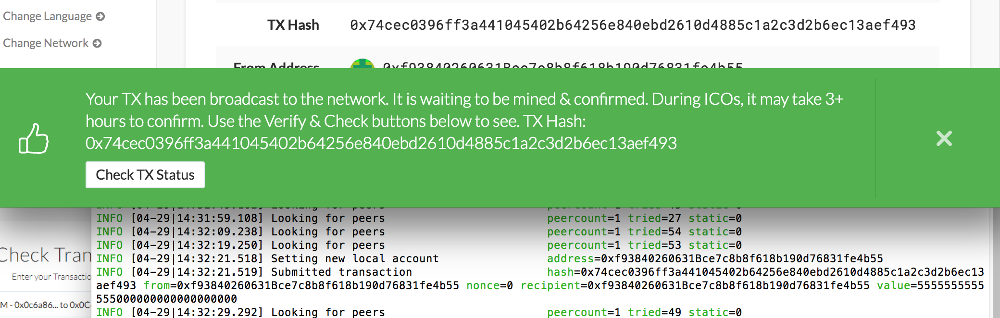

MacOS instructions for creating an Ethereum blockchain.
## Setup Instructions
You will need the following programs to set up the Ethereum Blockchain:
* [Git Bash](https://git-scm.com/downloads)
* [MyCrypto](https://download.mycrypto.com/)
* [Go Ethereum](https://geth.ethereum.org/downloads/) ('Geth')

## Create a blockchain with 'Geth' (Go Ethereum)
Generate the genesis block configurations with geth.
* Open Git Bash and change directories `cd Fintech/Homework/HW18-Blockchain` to the Blockchain-Tools folder.

* Run `./puppeth` and name your network.

* Select the option to `configure a new genesis block`. Next select `create new genesis from scratch`.

* Choose the `Clique - proof-of-authority` consensus algorithm.

 

* Paste the account address(es) from the MyCrypto steps into the list of accounts to seal.

* Press `enter` enter when prompted for pre-funding the pre-compiled accounts with wei.

* Set a numeric network ID (`829` was used in this example). 

* Now that you are back at the main menu, choose the `Manage existing genesis` option.

* Select `Export genesis configurations`. Hit enter and the files will be saved to the current directory 'Blockchain-Tools'. This will fail to create two of the files, but you only need json file with your network name (`hwblockchain.json` in this example). Press `ctrl+C` to exit the puppeth prompts.

   

Initialize each node with the new `networkname.json` with `geth`.

* Create accounts for two (or more) nodes for the network with a separate `datadir` for each using `geth`. Replace nodename with your node's name e.g. node1.

    `./geth account new --datadir nodename`

    Saving the 'Public address of the key' and 'Path of the secret key file' will allow you to restart the blockchain after closing.

  

* Initiate the nodes to follow the protocol set in the genesis block file `fintechtestnetwork.json`.

    `./geth init fintechtestnetwork.json --datadir node1`

    `./geth init fintechtestnetwork.json --datadir node2`

    

* Start mining with the first node. Make sure to capture the enode address. This will be used for the next step.

    `./geth --datadir node1 --mine --miner.threads 1`

    

* Start the second node using the first node's `enode` address as the `bootnode` flag.

    `./geth --datadir node2 --port 30304 --rpc --bootnodes "enode://eb47ce12ddc640f516004500f4ffe7dd7d2b8591643c3a0c837b7e8759a53b652b97250b305d7556e59873edcd54ae64c4fee808c5faa807931a5b1d5a3de19d@127.0.0.1:30303"`

    

## Send a test transaction
* Return the the MyCrypto app. On the lefthand-side click `Change Network` and the click `+Add Custom Node`.

* Enter the Node Name and Network Name. Set Network to Custom and Currency as ETH. The Network ID should be entered as the Chain ID. Use `http://127.0.0.1:8545` as the the URL. Click 'Save & Use Custom Node.'
    

* After saving the Custom Node, change the network on the left-hand side of the MyCrypto app to `hwblockchain`.
    

* Logging back into your wallet you will see a new account balance! Proceed with copying and pasting your Account Address into the To Address. This is to send a test transaction. Pick any amount and to prioritize the processing of this transaction set the Transaction Fee to the maximum amount. Click Send Transaction. A popup will prompt you to confirm sending the transaction. Click 'Send'.
    
* A green bar will pop up at the bottom of the app. In the screenshot below you can also see on the Git Bash window of node 2 that the transacion was submitted and the transaction hash. Click "TX Status" in the popup to see details of the transaction status.
    

* The transaction status screen provides details including Status, TX Hash, From Address, To Address, Amount, Gas Price, and Gas Limit.

* Click 'Check TX Status' to refresh. The status will say SUCCESSFUL when the complete. Additional details are added included Gas Used, and the Transaction Fee. Creating a blockchain and send a test transaction is now complete!
 
